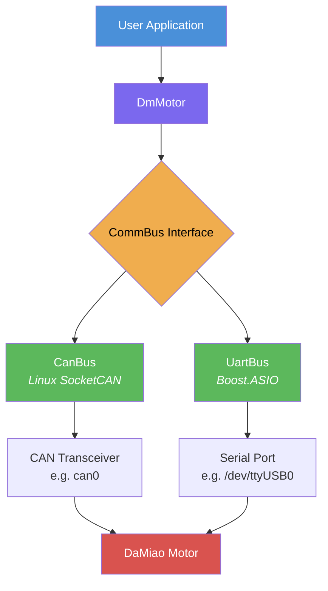
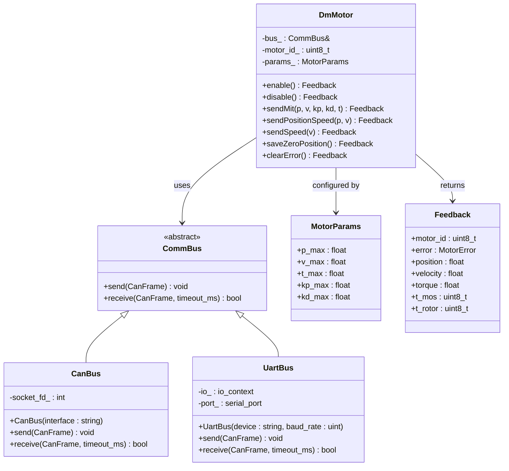
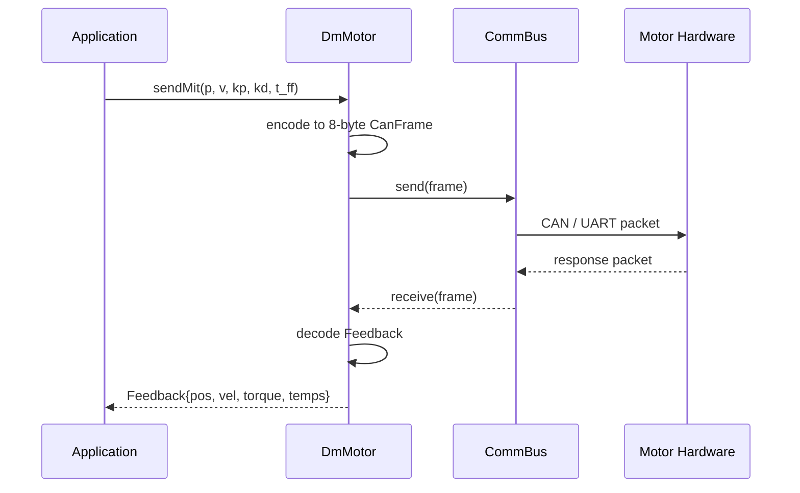
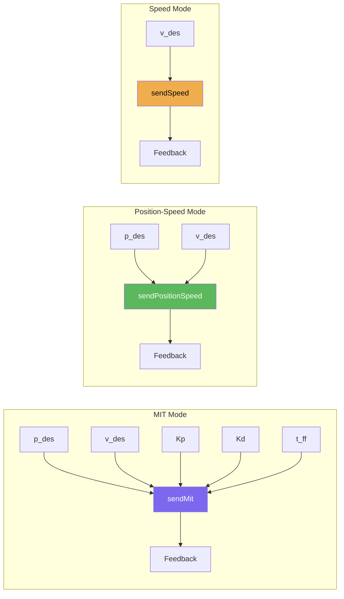

# damiao_driver


A modern C++17 library for controlling [DaMiao](https://www.damiao.info/) actuators (DM-J4310 and compatible) over **CAN bus** or **UART**, with a clean abstraction layer and zero-copy command encoding.

## Architecture



### Component Overview



### Data Flow



## Project Structure

```
damiao-driver-cpp/
├── CMakeLists.txt
├── include/damiao_driver/
│   ├── damiao_driver.hpp          # single-include header
│   ├── types.hpp           # enums, structs, conversions
│   ├── comm_bus.hpp        # abstract bus interface
│   ├── can_bus.hpp         # Linux SocketCAN
│   ├── uart_bus.hpp        # Boost.ASIO serial
│   └── motor.hpp           # motor control API
├── src/
│   ├── types.cpp
│   ├── can_bus.cpp
│   ├── uart_bus.cpp
│   └── motor.cpp
├── examples/
│   └── mit_control.cpp
├── tests/
│   ├── test_types.cpp
│   └── test_motor.cpp
└── docs/
    └── DM-J4310-en.pdf
```

## Dependencies

| Dependency | Version | Purpose |
|---|---|---|
| **CMake** | >= 3.22 | Build system |
| **C++ compiler** | C++17 | GCC 7+ / Clang 5+ |
| **Boost** | any recent | `boost::asio` for UART communication |
| **Linux headers** | — | `linux/can.h` for SocketCAN (CAN bus only) |
| **Catch2** | 3.8.1 | Unit tests (fetched automatically) |
| **Doxygen** | optional | API documentation generation |

## Installation

### Install dependencies (Ubuntu/Debian)

```bash
sudo apt update
sudo apt install -y build-essential cmake libboost-all-dev
```

### Build the library

```bash
git clone https://github.com/your-org/damiao-driver-cpp.git
cd damiao-driver-cpp
mkdir build && cd build
cmake ..
make -j$(nproc)
```

### Install system-wide

```bash
sudo make install
```

This installs headers to `/usr/local/include/damiao_driver/` and the library to `/usr/local/lib/`.

### Build with tests

```bash
cmake -DBUILD_TESTS=ON ..
make -j$(nproc)
ctest --output-on-failure
```

### Build with examples

```bash
cmake -DBUILD_EXAMPLES=ON ..
make -j$(nproc)
```

### Build with documentation

```bash
sudo apt install -y doxygen graphviz   # if not already installed
cmake -DBUILD_DOCS=ON ..
make docs
# open build/docs/html/index.html
```

## Usage

### Use in your CMake project

```cmake
find_package(damiao_driver REQUIRED)
target_link_libraries(your_target PRIVATE damiao_driver::damiao_driver)
```

### MIT Mode Control (CAN bus)

```cpp
#include <cstdio>
#include "damiao_driver/damiao_driver.hpp"

int main() {
  try {
    dm::CanBus bus("can0");
    dm::DmMotor motor(bus, 0x01);

    auto fb = motor.enable();
    std::printf("Enabled motor %u\n", fb.motor_id);

    // Hold position at 0 rad with Kp=50, Kd=1
    fb = motor.sendMit(0.0f, 0.0f, 50.0f, 1.0f, 0.0f);
    std::printf("Pos: %.3f rad  Vel: %.3f rad/s  Torque: %.3f Nm\n",
                fb.position, fb.velocity, fb.torque);

    motor.disable();
  } catch (const std::exception & e) {
    std::fprintf(stderr, "Error: %s\n", e.what());
    return 1;
  }
}
```

### UART Communication

```cpp
dm::UartBus bus("/dev/ttyUSB0", 921600);
dm::DmMotor motor(bus, 0x01);
// same motor API — only the transport changes
```

### Position-Speed & Speed Modes

```cpp
// Position-speed mode
fb = motor.sendPositionSpeed(1.57f, 5.0f);  // 1.57 rad at 5 rad/s

// Speed mode
fb = motor.sendSpeed(10.0f);                 // 10 rad/s
```

### Motor Lifecycle

```cpp
motor.enable();
motor.saveZeroPosition();  // calibrate current position as zero
motor.clearError();        // reset fault flags
motor.disable();
```

### Custom Motor Parameters

```cpp
dm::MotorParams custom = {
  .p_max  = 12.5f,   // rad
  .v_max  = 30.0f,   // rad/s
  .t_max  = 10.0f,   // Nm
  .kp_max = 500.0f,
  .kd_max = 5.0f,
};
dm::DmMotor motor(bus, 0x01, custom);
```

### CAN Interface Setup (Linux)

```bash
# Bring up a physical CAN interface
sudo ip link set can0 type can bitrate 1000000
sudo ip link set can0 up

# Or create a virtual CAN interface for testing
sudo modprobe vcan
sudo ip link add dev vcan0 type vcan
sudo ip link set vcan0 up
```

## Control Modes



| Mode | CAN ID | Parameters | Use Case |
|---|---|---|---|
| **MIT** | `motor_id` | position, velocity, Kp, Kd, torque | Full impedance control |
| **Position-Speed** | `0x100 + motor_id` | position, velocity | Trajectory tracking |
| **Speed** | `0x200 + motor_id` | velocity | Constant-speed tasks |

## DM-J4310 Default Limits

| Parameter | Range | Unit |
|---|---|---|
| Position | -12.5 to +12.5 | rad |
| Velocity | -30.0 to +30.0 | rad/s |
| Torque | -10.0 to +10.0 | Nm |
| Kp | 0 to 500.0 | — |
| Kd | 0 to 5.0 | — |

## Running Tests

```bash
cd build
cmake -DBUILD_TESTS=ON ..
make -j$(nproc)
ctest --output-on-failure
```

Tests cover:

- `test_types` — float/uint linear mapping, boundary clamping, round-trip accuracy
- `test_motor` — MIT/position-speed/speed encoding, feedback decoding, CAN ID assignment
