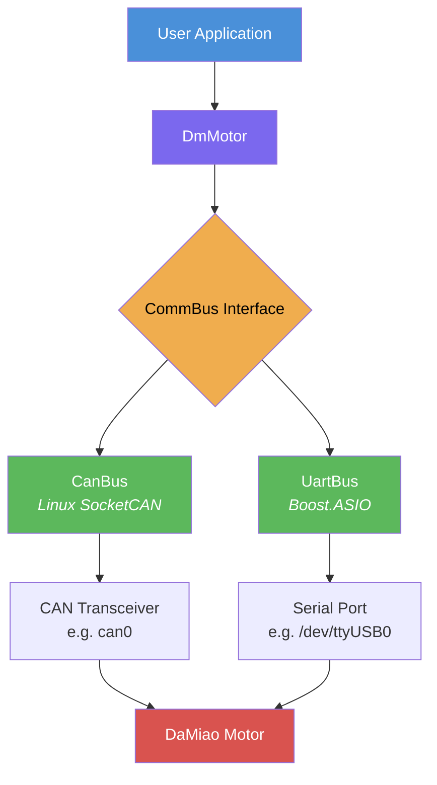
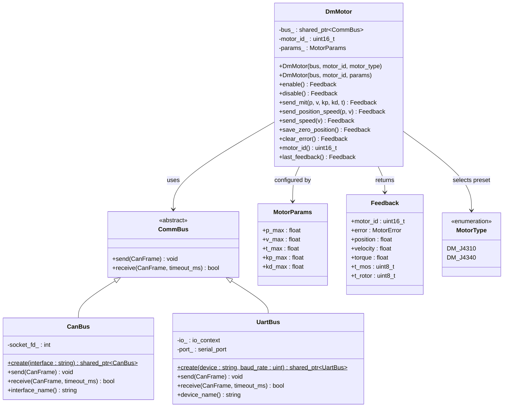
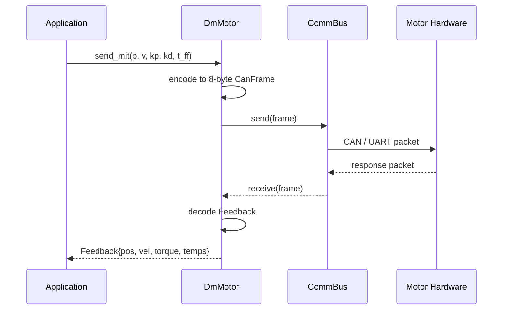
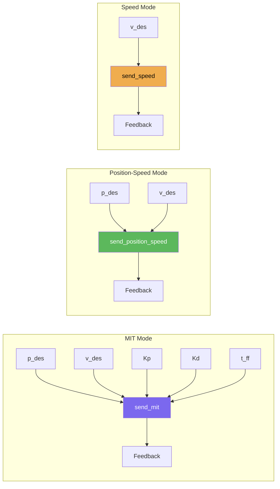

# DaMiao Motor Driver


A modern C++17 library for controlling [DaMiao](https://www.damiao.info/) actuators (DM-J4310, DM-J4340, and compatible) over **CAN bus** or **UART**, with a clean abstraction layer and zero-copy command encoding.

## Architecture



### Component Overview



### Data Flow



## Project Structure

```
damiao-driver-cpp/
├── CMakeLists.txt
├── Doxyfile.in                       # Doxygen config template
├── LICENSE                           # MIT License
├── include/damiao_driver/
│   ├── damiao_driver.hpp             # single-include convenience header
│   ├── types.hpp                     # enums, structs, conversions
│   ├── comm_bus.hpp                  # abstract bus interface
│   ├── can_bus.hpp                   # Linux SocketCAN
│   ├── uart_bus.hpp                  # Boost.ASIO serial
│   └── motor.hpp                     # motor control API
├── src/
│   ├── types.cpp
│   ├── can_bus.cpp
│   ├── uart_bus.cpp
│   └── motor.cpp
├── examples/
│   └── mit_control.cpp               # multi-motor MIT mode demo
├── tests/
│   ├── test_types.cpp                # float/uint mapping tests
│   ├── test_motor.cpp                # encoding, decoding, mock-bus tests
│   └── test_comm_bus.cpp             # hardware integration tests (vcan0, serial)
├── docs/
│   ├── DM-J4310-en.pdf
│   └── DM-J4340-en.pdf
└── .github/workflows/
    └── ci.yml                        # GitHub Actions CI
```

## Supported Motors

| Motor Type | Enum | Gear Ratio | Peak Torque | Max Velocity | Position Range |
|---|---|---|---|---|---|
| DM-J4310-2EC | `MotorType::DM_J4310` | 10:1 | 10.0 Nm | 30.0 rad/s | +/-12.5 rad |
| DM-J4340-2EC | `MotorType::DM_J4340` | 40:1 | 28.0 Nm | 10.0 rad/s | +/-12.5 rad |

Custom motor parameters can also be provided directly via `MotorParams`.

## Dependencies

| Dependency | Version | Purpose |
|---|---|---|
| **CMake** | >= 3.22 | Build system |
| **C++ compiler** | C++17 | GCC 7+ / Clang 5+ |
| **Boost** | any recent | `boost::asio` for UART communication |
| **Linux headers** | --- | `linux/can.h` for SocketCAN (CAN bus only) |
| **Catch2** | 3.8.1 | Unit tests (fetched automatically via FetchContent) |
| **Doxygen** | optional | API documentation generation |

## Recommended Hardware

| Adapter | Interface | Notes |
|---|---|---|
| [Pibiger USB to CAN Adapter](https://www.amazon.com/Pibiger-Analyzer-Speed-Isolated-Against/dp/B0CGPSDG8V) | SocketCAN | Isolated, high-speed, works out of the box on Linux |

## Installation

### Install dependencies (Ubuntu/Debian)

```bash
sudo apt update
sudo apt install -y build-essential cmake libboost-all-dev
```

### Build the library

```bash
git clone https://github.com/your-org/damiao-driver-cpp.git
cd damiao-driver-cpp
cmake -B build
cmake --build build -j$(nproc)
```

### Install system-wide

```bash
sudo cmake --install build
```

This installs headers to `/usr/local/include/damiao_driver/` and the library to `/usr/local/lib/`.

### Build with tests

```bash
cmake -B build -DBUILD_TESTS=ON
cmake --build build -j$(nproc)
ctest --test-dir build --output-on-failure
```

### Build with examples

```bash
cmake -B build -DBUILD_EXAMPLES=ON
cmake --build build -j$(nproc)
```

### Build with documentation

```bash
sudo apt install -y doxygen graphviz   # if not already installed
cmake -B build -DBUILD_DOCS=ON
cmake --build build --target docs
# open build/docs/html/index.html
```

## Usage

### Use in your CMake project

```cmake
find_package(damiao_driver REQUIRED)
target_link_libraries(your_target PRIVATE damiao_driver::damiao_driver)
```

### MIT Mode Control (CAN bus)

```cpp
#include <iostream>
#include "damiao_driver/damiao_driver.hpp"

int main()
{
  try
  {
    auto bus = dm::CanBus::create("can0");
    dm::DmMotor motor(bus, 0x01, dm::MotorType::DM_J4310);

    auto fb = motor.enable();
    std::cout << "Enabled motor " << fb.motor_id << "\n";

    // Hold position at 0 rad with Kp=50, Kd=1
    fb = motor.send_mit(0.0f, 0.0f, 50.0f, 1.0f, 0.0f);
    std::cout << "Pos: " << fb.position << " rad  "
              << "Vel: " << fb.velocity << " rad/s  "
              << "Torque: " << fb.torque << " Nm\n";

    motor.disable();
  }
  catch (const std::exception &e)
  {
    std::cerr << "Error: " << e.what() << "\n";
    return 1;
  }
}
```

### UART Communication

```cpp
auto bus = dm::UartBus::create("/dev/ttyUSB0", 921600);
dm::DmMotor motor(bus, 0x01);
// same motor API — only the transport changes
```

### Multiple Motors on the Same Bus

Bus instances are singletons -- calling `create()` with the same interface returns the same `shared_ptr`:

```cpp
auto bus = dm::CanBus::create("can0");

dm::DmMotor motor_j4310(bus, 0x01, dm::MotorType::DM_J4310);
dm::DmMotor motor_j4340(bus, 0x02, dm::MotorType::DM_J4340);

// Both motors share the same CAN bus instance
assert(dm::CanBus::create("can0") == bus);
```

### Position-Speed & Speed Modes

```cpp
// Position-speed mode
fb = motor.send_position_speed(1.57f, 5.0f);  // 1.57 rad at 5 rad/s

// Speed mode
fb = motor.send_speed(10.0f);                  // 10 rad/s
```

### Motor Lifecycle

```cpp
motor.enable();
motor.save_zero_position();  // calibrate current position as zero
motor.clear_error();         // reset fault flags
motor.disable();
```

### Custom Motor Parameters

```cpp
dm::MotorParams custom = {
  .p_max  = 12.5f,   // rad
  .v_max  = 30.0f,   // rad/s
  .t_max  = 10.0f,   // Nm
  .kp_max = 500.0f,
  .kd_max = 5.0f,
};
dm::DmMotor motor(bus, 0x01, custom);
```

### Selecting Motor Type by Enum

```cpp
// Use built-in presets instead of specifying params manually
dm::DmMotor motor(bus, 0x01, dm::MotorType::DM_J4340);

// Or look up params programmatically
dm::MotorParams params = dm::motor_params_for(dm::MotorType::DM_J4340);
```

### CAN Interface Setup (Linux)

```bash
# Bring up a physical CAN interface
sudo ip link set can0 type can bitrate 1000000
sudo ip link set can0 up

# Or create a virtual CAN interface for testing
sudo modprobe vcan
sudo ip link add dev vcan0 type vcan
sudo ip link set vcan0 up
```

## Control Modes



| Mode | CAN ID | Parameters | Use Case |
|---|---|---|---|
| **MIT** | `motor_id` | position, velocity, Kp, Kd, torque | Full impedance control |
| **Position-Speed** | `0x100 + motor_id` | position, velocity | Trajectory tracking |
| **Speed** | `0x200 + motor_id` | velocity | Constant-speed tasks |

> Motor ID (`uint16_t`) supports values from `0x01` to `0x5FF`.

## Motor Parameter Defaults

### DM-J4310

| Parameter | Range | Unit |
|---|---|---|
| Position | -12.5 to +12.5 | rad |
| Velocity | -30.0 to +30.0 | rad/s |
| Torque | -10.0 to +10.0 | Nm |
| Kp | 0 to 500.0 | --- |
| Kd | 0 to 5.0 | --- |

### DM-J4340

| Parameter | Range | Unit |
|---|---|---|
| Position | -12.5 to +12.5 | rad |
| Velocity | -10.0 to +10.0 | rad/s |
| Torque | -28.0 to +28.0 | Nm |
| Kp | 0 to 500.0 | --- |
| Kd | 0 to 5.0 | --- |

## Error Codes

| Error | Value | Description |
|---|---|---|
| `MotorError::None` | 0x0 | No error |
| `MotorError::Overvoltage` | 0x8 | Supply voltage too high |
| `MotorError::Undervoltage` | 0x9 | Supply voltage too low |
| `MotorError::Overcurrent` | 0xA | Current limit exceeded |
| `MotorError::MosOvertemp` | 0xB | MOSFET over-temperature |
| `MotorError::MotorOvertemp` | 0xC | Motor winding over-temperature |
| `MotorError::CommLoss` | 0xD | Communication lost |
| `MotorError::Overload` | 0xE | Mechanical overload |

## Running Tests

```bash
cmake -B build -DBUILD_TESTS=ON
cmake --build build -j$(nproc)
ctest --test-dir build --output-on-failure
```

Tests cover:

- `test_types` -- float/uint linear mapping, boundary clamping, round-trip accuracy, `motor_params_for()` lookup
- `test_motor` -- MIT/position-speed/speed encoding, feedback decoding, CAN ID assignment, wide motor ID support, `MotorType` preset selection, special command frames
- `test_comm_bus` -- CanBus/UartBus singleton factory, hardware integration (requires `vcan0` and `/tmp/ttyV0`)

> **Note:** `test_comm_bus` requires a live `vcan0` interface and `/tmp/ttyV0` virtual serial port. See [CAN Interface Setup](#can-interface-setup-linux) for `vcan0` setup.

## CI

This project uses GitHub Actions for continuous integration. The workflow (`.github/workflows/ci.yml`) runs on every push to `main` and:

- Builds the library, tests, and examples on Ubuntu 24.04
- Sets up `vcan0` and a virtual serial port via `socat`
- Runs all tests, gracefully skipping hardware-dependent tests if the virtual interfaces are unavailable

## License

MIT License. See [LICENSE](LICENSE) for details.
